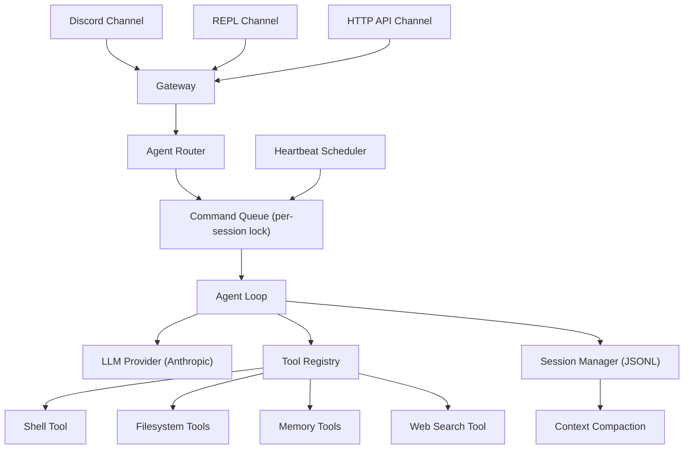

# QuickDraw Framework

## Architecture




## Project Structure

```
QuickDraw/
├── pyproject.toml
├── README.md
├── config.example.yaml          # Example configuration
├── SOUL.md                      # Default agent personality
├── quickdraw/
│   ├── __init__.py
│   ├── __main__.py              # CLI entry: `python -m quickdraw`
│   ├── config.py                # YAML config loader, env var resolution
│   ├── gateway.py               # Central orchestrator, channel lifecycle
│   ├── router.py                # Multi-agent message routing
│   ├── heartbeat.py             # Cron-based scheduled agent tasks
│   ├── core/
│   │   ├── __init__.py
│   │   ├── session.py           # JSONL session persistence
│   │   ├── compaction.py        # Context window summarization
│   │   ├── memory.py            # File-based long-term memory + search
│   │   ├── loop.py              # Agent loop (LLM + tool cycle)
│   │   ├── queue.py             # Per-session async locking
│   │   └── permissions.py       # Command safety + approval persistence
│   ├── tools/
│   │   ├── __init__.py
│   │   ├── registry.py          # Tool registration + discovery
│   │   ├── shell.py             # run_command (with permission checks)
│   │   ├── filesystem.py        # read_file, write_file
│   │   ├── memory_tools.py      # save_memory, memory_search
│   │   └── web.py               # web_search (placeholder)
│   └── channels/
│       ├── __init__.py
│       ├── base.py              # Abstract ChannelAdapter interface
│       ├── discord_channel.py   # Discord adapter (discord.py)
│       ├── repl.py              # Terminal REPL adapter
│       └── http_api.py          # HTTP API adapter (aiohttp)
```

## Key Design Decisions

- **Fully async** (`asyncio`) — Discord.py is async, and we want concurrent message handling across channels without threads
- **YAML config** — more readable than JSON for nested configs; supports `${ENV_VAR}` substitution for secrets
- **JSONL sessions** — append-only, crash-safe, one file per session (exactly as described in the blog post)
- **Tool registry pattern** — tools register via decorator (`@tool_registry.register`), making it easy to add custom tools
- **Channel adapter interface** — each channel implements `start()`, `stop()`, `send_message()` and emits incoming messages to the gateway
- **Anthropic first** — start with Anthropic's API; LLM provider abstraction can come later

## Phase 1: Core Foundation

Build the engine that makes everything work — sessions, the agent loop, tools, and config.

**Files:**

- `[quickdraw/config.py](quickdraw/config.py)` — Load `config.yaml`, resolve `${ENV_VAR}` references, provide typed access to settings (workspace path, LLM model, agent definitions, channel configs)
- `[quickdraw/core/session.py](quickdraw/core/session.py)` — `SessionManager` class: `load(session_key) -> list[dict]`, `append(session_key, message)`, `save(session_key, messages)`, `reset(session_key)`. Each session is a JSONL file at `{workspace}/sessions/{key}.jsonl`
- `[quickdraw/core/loop.py](quickdraw/core/loop.py)` — `AgentLoop` class: takes session messages + system prompt + tools, calls the Anthropic API in a loop, executes tool calls, feeds results back, returns final text. Max 20 iterations per turn. Handles `end_turn` and `tool_use` stop reasons
- `[quickdraw/tools/registry.py](quickdraw/tools/registry.py)` — `ToolRegistry` class with `register(name, description, schema, handler)` and `execute(name, input) -> str`. Returns tool definitions in Anthropic's format
- `[quickdraw/tools/shell.py](quickdraw/tools/shell.py)`, `[filesystem.py](quickdraw/tools/filesystem.py)`, `[memory_tools.py](quickdraw/tools/memory_tools.py)`, `[web.py](quickdraw/tools/web.py)` — Individual tool implementations, each registering with the registry
- `[quickdraw/core/permissions.py](quickdraw/core/permissions.py)` — `PermissionManager`: checks command against safe list, loads/saves approvals from `{workspace}/exec-approvals.json`, supports `ask`/`record`/`ignore` modes

## Phase 2: Channels + Gateway

Wire up Discord, REPL, and the gateway that ties them together.

**Files:**

- `[quickdraw/channels/base.py](quickdraw/channels/base.py)` — Abstract `ChannelAdapter` with:
  - `async start()` / `async stop()` lifecycle
  - `async send_message(session_key, text)` for outbound
  - Callback `on_message(session_key, user_text, reply_fn)` for inbound
- `[quickdraw/channels/discord_channel.py](quickdraw/channels/discord_channel.py)` — Discord adapter using `discord.py`. Listens for DMs and mentions. Maps `user_id` to session key. Handles message chunking for Discord's 2000-char limit
- `[quickdraw/channels/repl.py](quickdraw/channels/repl.py)` — Terminal REPL adapter. Reads stdin in an async loop. Supports `/new`, `/quit`, `/research` commands
- `[quickdraw/channels/http_api.py](quickdraw/channels/http_api.py)` — `aiohttp` server exposing `POST /chat` endpoint. Takes `{user_id, message}`, returns `{response}`
- `[quickdraw/gateway.py](quickdraw/gateway.py)` — `Gateway` class: reads config, instantiates enabled channels, registers their `on_message` callbacks to route through the agent loop. Manages the async event loop lifecycle. Single entry point: `gateway.run()`
- `[quickdraw/core/queue.py](quickdraw/core/queue.py)` — `CommandQueue` with per-session `asyncio.Lock`. Ensures only one message processes per session at a time. Different sessions run concurrently

## Phase 3: Advanced Features

Memory, compaction, heartbeats, and multi-agent routing.

**Files:**

- `[quickdraw/core/memory.py](quickdraw/core/memory.py)` — `MemoryStore` class: saves memories as markdown files in `{workspace}/memory/`, keyword search across all files. (Vector search is a future enhancement)
- `[quickdraw/core/compaction.py](quickdraw/core/compaction.py)` — `compact_session(messages)`: estimates tokens (~4 chars/token), if over threshold (100k), splits in half, summarizes old half via LLM, prepends summary to recent half
- `[quickdraw/heartbeat.py](quickdraw/heartbeat.py)` — `HeartbeatScheduler`: reads heartbeat configs from YAML, runs agent turns on cron schedules using `asyncio` tasks. Each heartbeat gets its own session key (`cron:{name}`)
- `[quickdraw/router.py](quickdraw/router.py)` — `AgentRouter`: resolves which agent config handles a message based on prefix commands (`/research` -> researcher agent). Returns agent config + cleaned message text

## Phase 4: Entry Point + Packaging

- `[pyproject.toml](pyproject.toml)` — Package metadata, dependencies: `anthropic`, `discord.py`, `pyyaml`, `aiohttp`, `croniter` (for cron parsing). Entry point: `quickdraw = "quickdraw.__main__:main"`
- `[quickdraw/__main__.py](quickdraw/__main__.py)` — CLI: `quickdraw run` starts the gateway, `quickdraw init` scaffolds a workspace with default config + SOUL.md
- `[config.example.yaml](config.example.yaml)` — Documented example config
- `[SOUL.md](SOUL.md)` — Default agent personality template

## Config Format

```yaml
workspace: ~/.quickdraw

llm:
  provider: anthropic
  model: claude-sonnet-4-5-20250929
  max_tokens: 4096

agents:
  main:
    name: Jarvis
    soul: SOUL.md
  researcher:
    name: Scout
    soul: souls/researcher.md

channels:
  discord:
    enabled: true
    token: ${DISCORD_BOT_TOKEN}
    session_scope: per-user
  repl:
    enabled: true
  http:
    enabled: true
    port: 5000

heartbeats:
  morning-briefing:
    schedule: "30 7 * * *"
    agent: main
    prompt: "Good morning! Check the date and give a motivational quote."

permissions:
  mode: ask
  safe_commands:
    - ls
    - cat
    - date
    - pwd
    - git
    - python
```

