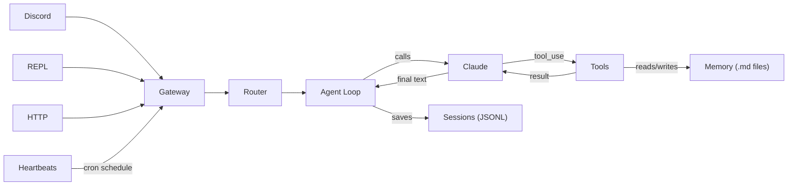
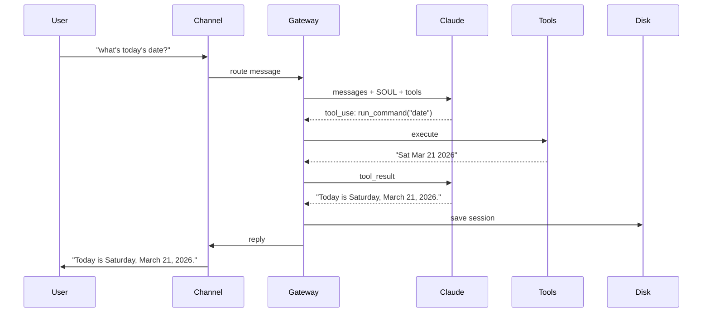

# QuickDraw Architecture

## How It Works

You send a message from any channel. The Gateway routes it to an agent. The agent calls Claude, executes any tools Claude requests, and sends the response back. Everything is saved to disk.



## Message Flow



## Components

| Component | What it does |
|-----------|-------------|
| **Gateway** | Central hub. Receives messages from all channels, routes them through the agent, saves sessions. |
| **Agent Loop** | Calls Claude, executes tool requests, feeds results back, repeats until Claude returns text. |
| **Sessions** | JSONL files in `~/.quickdraw/sessions/`. One file per conversation. Append-only, crash-safe. |
| **Memory** | Markdown files in `~/.quickdraw/memory/`. Persists across session resets. Agent saves/searches via tools. |
| **Tools** | `run_command`, `read_file`, `write_file`, `save_memory`, `memory_search`, `web_search` |
| **Permissions** | Safe commands run automatically. Unknown commands are denied. Approvals persist to disk. |
| **Router** | `/research` goes to Scout agent. Everything else goes to Jarvis. Agents share memory but have separate sessions. |
| **Channels** | Discord (DMs + mentions), Terminal REPL, HTTP API (`POST /chat`). All share the same agent and memory. |
| **Compaction** | When a session exceeds ~100K tokens, older messages are summarized by Claude and replaced with the summary. |
| **Heartbeats** | Cron-scheduled prompts. Each gets its own session so it doesn't clutter your conversations. |

## File Layout

```
~/.quickdraw/                  # Runtime data
├── config.yaml                # Configuration
├── SOUL.md                    # Agent personality (system prompt)
├── sessions/*.jsonl           # Conversation history
├── memory/*.md                # Long-term memories
└── exec-approvals.json        # Command allowlist

QuickDraw/                     # Source code
└── quickdraw/
    ├── __main__.py            # CLI (init / run)
    ├── config.py              # YAML config loader
    ├── gateway.py             # Central orchestrator
    ├── router.py              # Multi-agent routing
    ├── heartbeat.py           # Cron scheduler
    ├── core/
    │   ├── loop.py            # LLM + tool cycle
    │   ├── session.py         # JSONL persistence
    │   ├── queue.py           # Per-session locking
    │   ├── compaction.py      # Context summarization
    │   ├── memory.py          # Memory store
    │   └── permissions.py     # Command safety
    ├── tools/
    │   ├── registry.py        # Tool registration
    │   ├── shell.py           # run_command
    │   ├── filesystem.py      # read_file, write_file
    │   ├── memory_tools.py    # save_memory, memory_search
    │   └── web.py             # web_search
    └── channels/
        ├── base.py            # Channel interface
        ├── discord_channel.py
        ├── repl.py
        └── http_api.py
```
