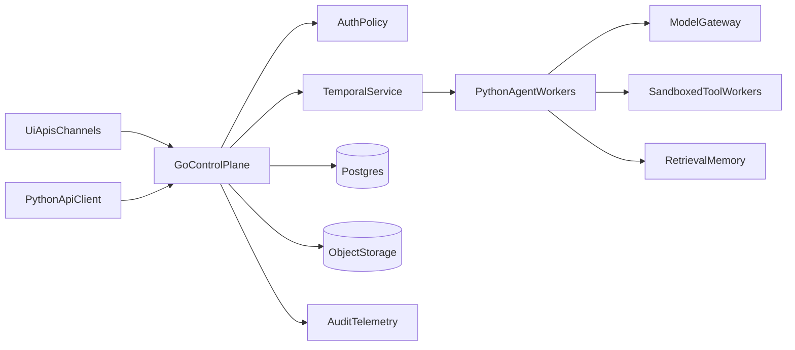

# QuickDraw V2 Design

## Goal

QuickDraw V2 turns the current single-process agent runtime into a lightweight platform for durable, tenant-aware enterprise workflows. The product should stay simple at the edge, but gain the control-plane, security, and workflow guarantees needed for corporate deployment.

## Design Principles

- Keep the Python agent runtime for fast iteration and domain logic.
- Add a Go control plane for auth, routing, tenancy, and operational reliability.
- Use Temporal for durable execution instead of building custom retry and resume logic.
- Make workflows typed and auditable; keep unconstrained chat as a narrow mode.
- Treat tools, connectors, and memory as governed infrastructure, not prompt-driven side effects.

## Architectural Decisions

- `Postgres` is the primary system of record. Do not introduce Mongo in the first major platform revision.
- `Temporal` owns durable workflow state transitions; `Postgres` owns product metadata and queryable state.
- `Go` is the only public edge and reverse proxy. `Python` workers are private services.
- Risky tools execute out of process in sandboxed workers.
- Shared business agents are modeled as conversations, participants, subscriptions, and outbound deliveries, not as direct reply callbacks.
- New enterprise channels should target `MS Teams` first. `Signal` is optional and lower priority.

## Target Architecture

## Service Boundaries

### Go control plane

Responsibilities:

- Public API edge and reverse proxy
- SSO/OIDC login and token validation
- Tenant resolution and authorization checks
- Agent, workflow, run, approval, and connector metadata APIs
- Temporal workflow submission and status APIs
- Audit event ingestion and operational telemetry
- Streaming fan-out for UI and external clients

The Go service should be the only internet-facing service. It should reverse proxy or dispatch requests to internal Python workers only after identity, tenant, and policy checks pass.

Suggested API surface:

- `POST /v1/runs`
- `GET /v1/runs/{run_id}`
- `POST /v1/runs/{run_id}/cancel`
- `POST /v1/approvals/{approval_id}/decision`
- `GET /v1/agents`
- `POST /v1/agents`
- `POST /v1/workflows`
- `GET /v1/events/stream`

### Python execution plane

Responsibilities:

- Agent loop execution
- Tool planning and domain logic
- Structured prompt assembly
- Retrieval, summarization, and model provider adapters
- Emitting typed run-step events back to the control plane

Python workers should not own identity, tenancy, or approval policy. They should receive a signed execution envelope from the Go service or Temporal activity input.

### Sandboxed tool workers

Responsibilities:

- File, shell, browser, and connector execution
- Resource limits and network egress controls
- Idempotent execution records
- Typed input/output envelopes for auditing

Risky tools should never execute inside the same process as the control plane or agent workers.

### Shared channel model

QuickDraw V2 should support shared agents that can be subscribed to by multiple users and can speak back into shared channels or direct subscriber targets.

Minimum shared messaging concepts:

- `conversation`: logical thread or shared business context
- `participant`: human or agent member of a conversation
- `subscription`: who receives updates for a conversation or workflow
- `delivery_target`: Teams thread, Signal chat, webhook, email, or internal inbox
- `outbound_message`: a durable outbound event awaiting delivery and retry

This replaces the current one-request one-reply callback model with a durable event and delivery model that is better suited to enterprise workflows.

## Workflow Runtime

QuickDraw V2 should support two run types:

- `interactive_run`: low-latency assistant turn or short conversation
- `durable_run`: long-running workflow with retries, approvals, waits, and external callbacks

Temporal should be the source of truth for durable workflow progress. Postgres remains the source of truth for metadata and queryable product state.

Execution model:

1. Client submits a run to the Go control plane.
2. Go validates identity, tenant, policy, and requested workflow.
3. Go records the run in Postgres and starts a Temporal workflow.
4. Temporal schedules Python worker activities for planning, execution, validation, or summarization.
5. Python workers call sandboxed tools through typed activities or internal RPC.
6. Approval-required actions pause via Temporal and resume only on explicit decision events.
7. Run state, step outputs, and audit events are persisted throughout execution.

This gives crash recovery, replay, retries, and human-in-the-loop support without rebuilding workflow infrastructure inside QuickDraw.

## Data Model

Use Postgres as the primary relational store. It fits tenancy, approvals, versioning, and workflow state better than Mongo for the first serious platform version.

Core tables:

- `tenant`
- `user`
- `membership`
- `agent`
- `agent_version`
- `workflow`
- `workflow_version`
- `run`
- `run_step`
- `approval_request`
- `approval_decision`
- `tool_execution`
- `connector`
- `credential_reference`
- `policy_binding`
- `audit_event`

Recommended storage split:

- `Postgres`: metadata, run state, approvals, agent/workflow versions, policies
- `Object storage`: transcripts, attachments, generated artifacts, large tool payloads
- `pgvector` or external vector index: optional retrieval layer when semantic memory is needed

Minimal schema guidance:

- Every major row should carry `tenant_id`.
- `run` should reference `agent_version_id`, `workflow_version_id`, `initiator_user_id`, and Temporal workflow identifiers.
- `run_step` should store typed step kinds such as `plan`, `tool_call`, `approval_wait`, `model_response`, `validation`, and `finalize`.
- `approval_request` should store risk level, requested action, policy reason, expiry, and resolver metadata.
- `tool_execution` should store capability name, sandbox worker, input hash, output pointer, duration, and exit status.
- `audit_event` should be append-only.

## Auth And Security

Security should be explicit infrastructure, not a property of the prompt.

Required controls:

- SSO/OIDC for human users
- Service-to-service auth for Go, Temporal workers, and Python workers
- Tenant isolation across APIs, storage, workflows, and connectors
- Capability-based permissions per agent and per workflow
- Policy checks before tool execution and before outbound actions
- Short-lived credentials with secret references, not raw secrets in runtime config
- Full audit trail for model calls, tool calls, approvals, and connector actions
- Default-deny posture for dangerous tools and external side effects

Capability model:

- Agents get a declared set of tools and connector scopes.
- Workflows narrow those capabilities further.
- Human approvals are required for high-risk actions such as outbound posting, file mutation outside approved scopes, privileged connector calls, or regulated workflow transitions.

Approval model:

- The agent does not block waiting in chat.
- Approval requests are durable workflow states.
- Approvers receive a typed action summary, affected resource, justification, and diff when possible.
- Decisions resume the Temporal workflow through a signed callback path.

## Memory And Retrieval

Current markdown memory is useful as a local prototype but should not be the long-term design.

V2 memory should separate:

- `session context`: recent conversation or run-local state
- `working memory`: run-scoped notes and intermediate facts
- `durable memory`: curated tenant knowledge and agent memories

Durable memory records should carry provenance, confidence, source type, timestamps, and optional expiry. Untrusted user text should not become durable memory automatically.

## Deployment Model

Support three deployment shapes:

- `local_dev`: single-node mode for development and debugging
- `managed_hybrid`: hosted control plane with private customer workers
- `dedicated_enterprise`: isolated runtime plane per tenant or per region

Packaging guidance:

- Docker for all services
- Kubernetes for enterprise execution planes when tenant isolation or scale requires it
- Separate worker pools for chat, durable workflows, retrieval/indexing, and tool execution

The Go control plane can sit in front of Python services as a reverse proxy and orchestration layer, while a second Python API client can call the Go API for run submission, approvals, and run status polling.

## Channel Strategy

Initial channel priorities:

- `HTTP API` remains the platform integration surface.
- `MS Teams` is the first enterprise messaging channel.
- `Discord` stays useful for internal development and demos.
- `Signal` is deferred until the shared conversation and outbound delivery model is in place.

Reasoning:

- Teams is enterprise-native and maps well to shared threads, tenants, and approvals.
- Signal is feasible, but should not shape the initial platform architecture.

## Observability

Adopt OpenTelemetry early and treat agent runs like production workflows.

Track at minimum:

- `tenant_id`
- `user_id`
- `agent_id`
- `agent_version_id`
- `workflow_id`
- `run_id`
- `run_step_id`
- `tool_name`
- `model_name`
- latency, retries, token usage, approval state, and policy denials

Use three outputs:

- metrics for operations and autoscaling
- traces for debugging and performance
- append-only audit events for compliance

## Migration From Current Repo

Keep and evolve:

- `quickdraw/gateway.py` as the orchestration spine
- `quickdraw/channels/base.py` as the channel abstraction
- `quickdraw/tools/registry.py` as the capability registry
- `quickdraw/router.py` as the seed of routing and specialization

Graduate or replace:

- `quickdraw/core/session.py` with DB-backed session and run storage
- `quickdraw/core/loop.py` with provider abstraction and non-blocking execution
- `quickdraw/tools/shell.py` with remote sandbox execution
- `quickdraw/tools/filesystem.py` with scoped file services
- `quickdraw/tools/memory_tools.py` with governed retrieval and durable memory records

## Branch Scope

This branch should carry the first major architectural slice, not every platform feature at once.

In scope for the first major branch:

- Postgres-backed tenant, agent, workflow, run, approval, and audit models
- Go control plane skeleton with auth middleware and core API routes
- Temporal workflow bootstrap for durable runs
- Python worker boundary for agent execution
- Remote tool execution interface, even if only one sandbox worker is implemented first

Out of scope for the first major branch:

- Full enterprise UI
- Full connector catalog
- Complete Signal support
- Medical RCM-specific compliance logic